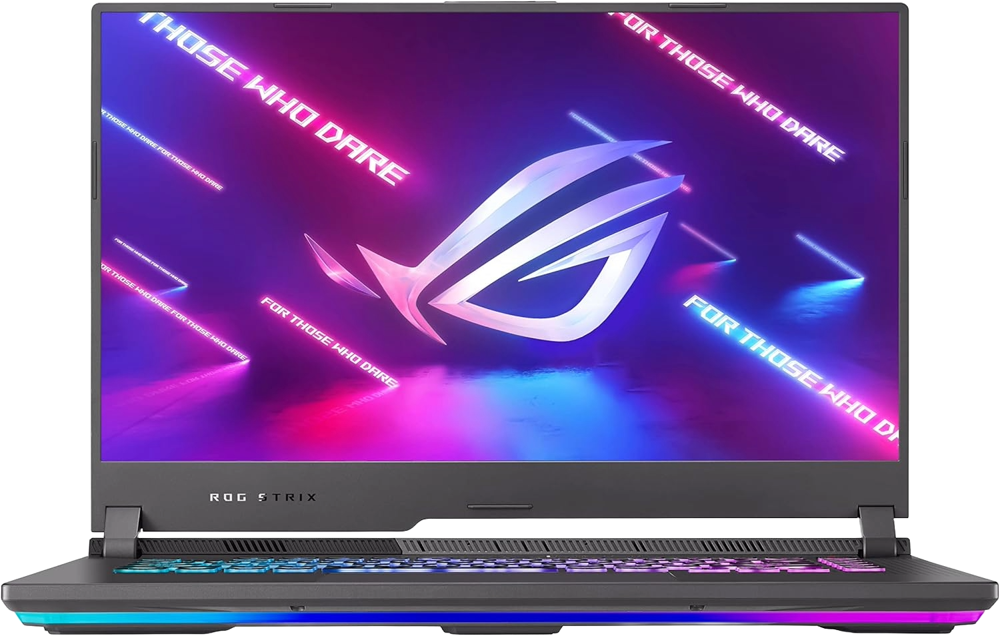
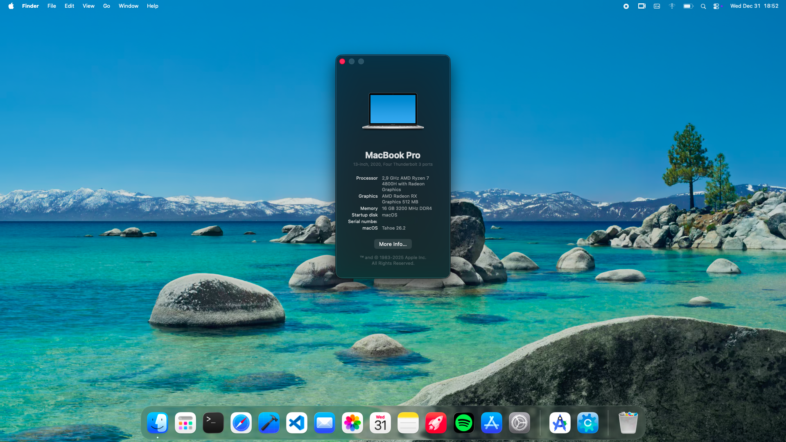
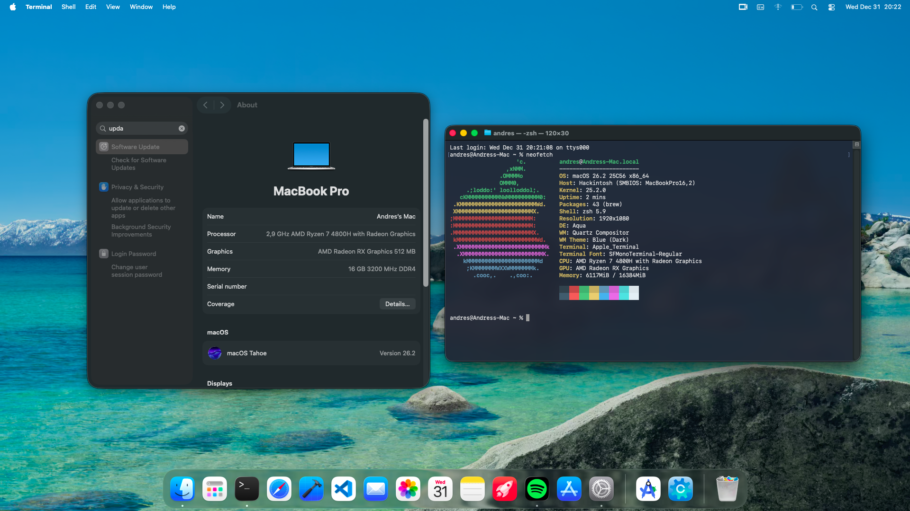
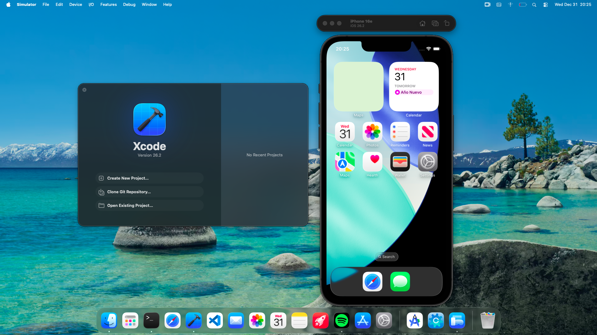

# EFI for Hackintosh on ASUS ROG Strix G15 (G513IC)

## Disclaimer
Use your own SMBIOS data, MacBookPro16,2 is recommended.

Use this EFI at your own risk. I am not responsible for any damage, data loss, or issues that may occur.

  

## Specifications

| Component | Model | Status |
|---|---|---|
| CPU | AMD Ryzen 7 4800H | Up to macOS Tahoe 26 |
| iGPU | AMD Radeon Vega 7 | macOS Catalina 10.15 to macOS Tahoe 26 |
| dGPU | NVIDIA GeForce RTX 3050 Laptop | Unsupported |
| Audio | Realtek Audio | Up to macOS Tahoe 26 |
| Ethernet | Realtek PCIe GbE Family Controller | Up to macOS Tahoe 26 |
| Wi-Fi | MediaTek Wi-Fi 6 MT7921 | Unsupported (replace card or use USB Wi-Fi) |
| Bluetooth | MediaTek Bluetooth Adapter | Unsupported |
| Storage | NVMe SSD | Up to macOS Tahoe 26 |

## What Works

- iGPU acceleration (post-install)
- Audio
- Ethernet
- USB
- Keyboard
- Trackpad
- Brightness keys
- Power management

## What Doesn't Work

- Wi-Fi
- Bluetooth
- NVIDIA dGPU

## Installation Notes

- Generate and inject your own SMBIOS data before booting.
- Enable `WhateverGreen.kext` and disable `NootedRed.kext`.
- After installation, re-enable `NootedRed.kext`.
- If you update OpenCore or kexts, re-check `config.plist` settings and load order.

## BIOS Settings

- Disable Secure Boot
- Disable Fast Boot
- SATA Mode: AHCI

## Kexts Used

- [AMDRyzenCPUPowerManagement](https://github.com/trulyspinach/SMCAMDProcessor)
- [AMFIPass](https://github.com/dortania/AMFIPass)
- [AppleALC](https://github.com/acidanthera/AppleALC)
- [AppleMCEReporterDisabler](https://github.com/1Revenger1/AppleMCEReporterDisabler)
- [BrightnessKeys](https://github.com/acidanthera/BrightnessKeys)
- [ECEnabler](https://github.com/1Revenger1/ECEnabler)
- [ForgedInvariant](https://github.com/acidanthera/ForgedInvariant)
- [GenericUSBXHCI](https://github.com/RehabMan/OS-X-Generic-USB3)
- [Lilu](https://github.com/acidanthera/Lilu)
- [NootedRed](https://github.com/ChefKissInc/NootedRed)
- [NVMeFix](https://github.com/acidanthera/NVMeFix)
- [RealtekRTL8111](https://github.com/Mieze/RTL8111_driver_for_OS_X)
- [RestrictEvents](https://github.com/acidanthera/RestrictEvents)
- [SMCAMDProcessor](https://github.com/trulyspinach/SMCAMDProcessor)
- [SMCBatteryManager](https://github.com/acidanthera/VirtualSMC)
- [SMCLightSensor](https://github.com/acidanthera/VirtualSMC)
- [SMCRadeonSensors](https://github.com/acidanthera/VirtualSMC)
- [USBToolBox](https://github.com/USBToolBox/kext)
- [UTBMap](https://github.com/USBToolBox/kext)
- [VirtualSMC](https://github.com/acidanthera/VirtualSMC)
- [VoodooI2C](https://github.com/VoodooI2C/VoodooI2C)
- [VoodooI2CHID](https://github.com/VoodooI2C/VoodooI2C)
- [VoodooPS2Controller](https://github.com/acidanthera/VoodooPS2)
- [WhateverGreen](https://github.com/acidanthera/WhateverGreen)

## Screenshots

  

  

  

## Credits

- [Apple](https://github.com/apple) for macOS
- [Dortania](https://dortania.github.io/OpenCore-Install-Guide) for the guide
- [Acidanthera](https://github.com/acidanthera) for OpenCore and kexts
- [ChefKissInc](https://github.com/ChefKissInc) for NootedRed
- [VoodooI2C Team](https://github.com/VoodooI2C) for touchpad support
- [USBToolBox](https://github.com/USBToolBox) for USB mapping tools
- [Mieze](https://github.com/Mieze) for RealtekRTL8111
- [1Revenger1](https://github.com/1Revenger1) for ECEnabler and AppleMCEReporterDisabler
- [RehabMan](https://github.com/RehabMan) for GenericUSBXHCI
- [trulyspinach](https://github.com/trulyspinach) for SMCAMDProcessor
- Hackintosh community

